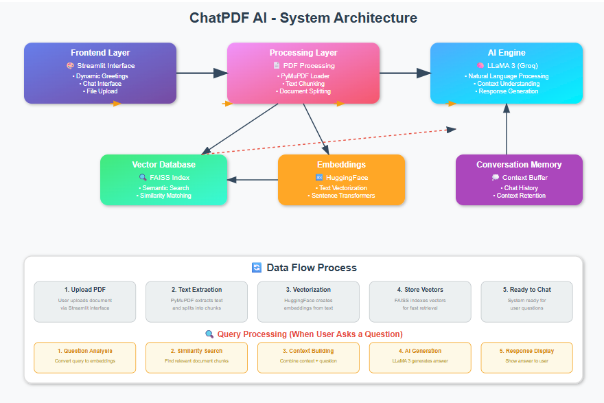

#  ChatPDF AI - Intelligent Document Conversation Assistant

> **Upload any large PDF and interact with it—ask questions and get answers powered by AI.**


---
##  Architecture



The system follows a modern **RAG (Retrieval Augmented Generation)** architecture:

1. **Document Processing**: PDF text extraction and intelligent chunking
2. **Vector Database**: FAISS-based semantic search for relevant content retrieval  
3. **AI Integration**: LLaMA 3 via Groq for natural language understanding and generation
4. **User Interface**: Streamlit-powered responsive web application

---


##  Features

- *** Instant PDF Processing** - Upload and chat with any PDF in seconds
- *** Natural Conversations** - Ask questions in plain English, get intelligent answers  
- *** Context-Aware Responses** - Maintains conversation history for follow-up questions
- *** Lightning Fast** - Powered by Groq's ultra-fast LLaMA 3 inference
- *** Modern UI** - Clean, ChatGPT-inspired interface with dynamic greetings

---

## Interface

### Main Interface


### Chat Experience  


---

##  Quick Start

### Prerequisites

- Python 3.8 or higher
- Groq API key ([Get one free here](https://console.groq.com/))
- VS Code (recommended for development)

### Installation

**1. Clone the repository**
```bash
git clone https://github.com/your-username/chatpdf-ai.git
cd chatpdf-ai
```

**2. Open in VS Code**  
```bash
code .
```

**3. Install dependencies**
```bash
pip install -r requirements.txt
```

**4. Set up environment variables**

Create a `.env` file in the root directory:
```env
GROQ_API_KEY=your_groq_api_key_here
```

**5. Run the application**
```bash
streamlit run app.py
```


##  Technologies Used

| Component | Technology | Purpose |
|-----------|------------|---------|
| **Frontend** | [Streamlit](https://streamlit.io/) | Interactive web interface |
| **AI Model** | [LLaMA 3 70B](https://llama.meta.com/) | Natural language processing |
| **Inference** | [Groq](https://groq.com/) | Ultra-fast AI inference |
| **Framework** | [LangChain](https://python.langchain.com/) | AI application development |
| **Vector DB** | [FAISS](https://faiss.ai/) | Similarity search and clustering |
| **Embeddings** | [HuggingFace](https://huggingface.co/) | Text-to-vector conversion |
| **PDF Processing** | [PyMuPDF](https://pymupdf.readthedocs.io/) | PDF text extraction |

##  Configuration

### Environment Variables (.env)
```bash
# Required
GROQ_API_KEY=your_groq_api_key_here

# Model used
MODEL_NAME=llama3-70b-8192
CHUNK_SIZE=1000
CHUNK_OVERLAP=100
MAX_TOKENS=2048
```